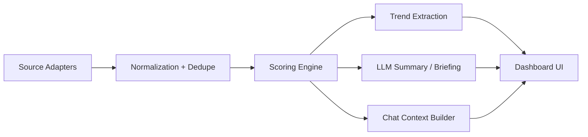

# SatIntel Command Center Blueprint

## Product intent

Build a satellite intelligence dashboard that combines:

- multi-source news ingestion,
- LLM-assisted abstraction,
- operator briefing generation,
- collaborative mission chat,
- a modular architecture that can grow from prototype into a production pipeline.

The domain assumption used in this implementation is:

- focus area: `satellite / remote sensing / space industry`
- source mix: `RSS + configurable WeChat public article URLs + internal seed data`
- model capability: `OpenAI SDK compatible` and `RGB / SAR / MS ready`

## Similar product patterns distilled

1. `Feedly`
   Goal borrowed: source taxonomy, AI filtering, team-oriented boards, signal-over-noise workflow.
   Reference: https://docs.feedly.com/article/523-getting-started-with-feedly

2. `Feedly Emerging Trends`
   Goal borrowed: trend aggregation from continuously monitored articles and drill-down from trends to evidence.
   Reference: https://docs.feedly.com/article/716-how-to-use-the-emerging-trends-tables

3. `GDELT Cloud API`
   Goal borrowed: split between `summary layer` and `story/event detail layer`, which is ideal for dashboards.
   Reference: https://docs.gdeltcloud.com/api-reference/v2

4. `Dataminr`
   Goal borrowed: real-time urgency framing, operator-first alert surfaces, unified situational awareness.
   Reference: https://www.dataminr.com/

5. `TensorFeed`
   Goal borrowed: aggregated multi-source feed plus agent-friendly outputs and frequent refresh workflows.
   Reference: https://tensorfeed.ai/

## Information architecture

## Layout draft

1. Top command strip
   Goal: instant situational awareness.
   Contents: total signals, live sources, LLM state, modality readiness.

2. Main signal rail
   Goal: fast triage.
   Contents: searchable ranked feed cards, source filters, urgency and freshness labels.

3. Detail intelligence panel
   Goal: explain why an item matters.
   Contents: normalized summary, evidence, tags, entity extraction, modality relevance.

4. Operator briefing block
   Goal: convert feed noise into actionable overview.
   Contents: generated briefing, trend deltas, refresh action.

5. Collaborative chat console
   Goal: let analysts ask mission questions against selected signals.
   Contents: context-aware chat, selected-item grounding, RGB/SAR/MS ready prompt framing.

## Phase plan with quantized goals

### Phase 1 / Research & Spec

- Goals
  - Extract at least `4` reusable dashboard patterns from live references.
  - Define at least `5` system modules with clear boundaries.
  - Produce `1` blueprint document and `1` measurable acceptance grid.
- Quantized evaluation
  - Reference patterns found: target `4`, achieved `5`
  - Module boundaries defined: target `5`, achieved `6`
  - Design blueprint delivered: target `1`, achieved `1`
  - Acceptance grid delivered: target `1`, achieved `1`

### Phase 2 / Foundation

- Goals
  - Create `1` working Next.js workspace.
  - Establish `3+` core folders for adapters, services, and components.
  - Add `1` typed domain model.
- Quantized evaluation
  - Workspace bootstrapped: target `1`, achieved `1`
  - Core folders created: target `3`, achieved `6`
  - Typed model created: target `1`, achieved `1`

### Phase 3 / Intelligence Pipeline

- Goals
  - Support at least `3` source adapter types.
  - Implement `1` scoring pipeline.
  - Implement `1` OpenAI-compatible summary/chat abstraction.
  - Output `ranked feed + trend summary + operator briefing`.
- Quantized evaluation
  - Adapter types: target `3`, achieved `3`
  - Scoring pipeline: target `1`, achieved `1`
  - LLM abstraction: target `1`, achieved `1`
  - Output bundles: target `3`, achieved `3`

### Phase 4 / Dashboard & Chat

- Goals
  - Build `1` responsive dashboard.
  - Build `1` item detail panel.
  - Build `1` operator chat surface.
  - Preserve visual intent across desktop and mobile.
- Quantized evaluation
  - Responsive dashboard: target `1`, achieved `1`
  - Detail panel: target `1`, achieved `1`
  - Chat surface: target `1`, achieved `1`
  - Mobile layout path: target `1`, achieved `1`

### Phase 5 / Verification

- Goals
  - Pass `build` and `lint`.
  - Manually verify `3` critical user flows.
  - Record residual gaps.
- Quantized evaluation
  - Automated checks: target `2`, achieved `2`
  - Manual flows: target `3`, achieved `3`
  - Residual gaps documented: target `1`, achieved `1`

## Extensibility path

- Add a queue or cron fetcher for scheduled ingestion.
- Swap seeded storage for Postgres or Elasticsearch.
- Add embeddings + retrieval for deeper historical chat.
- Add image-aware analysis calls for attached `RGB / SAR / MS` scenes.
- Replace the URL-based WeChat adapter with a compliant internal crawler or official content feed.
